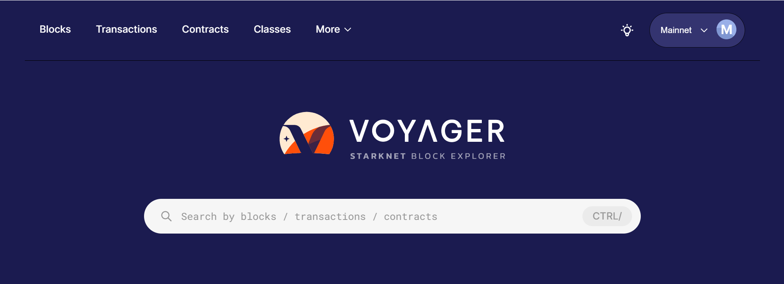
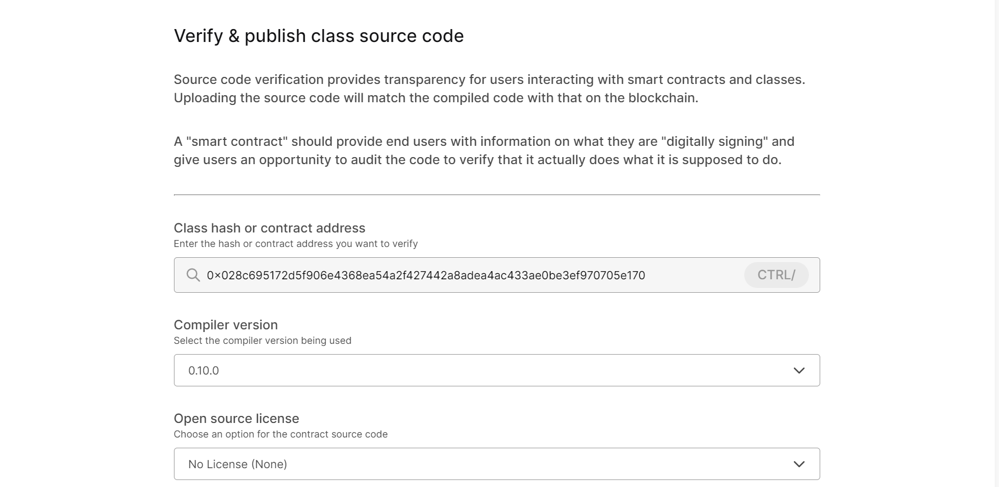
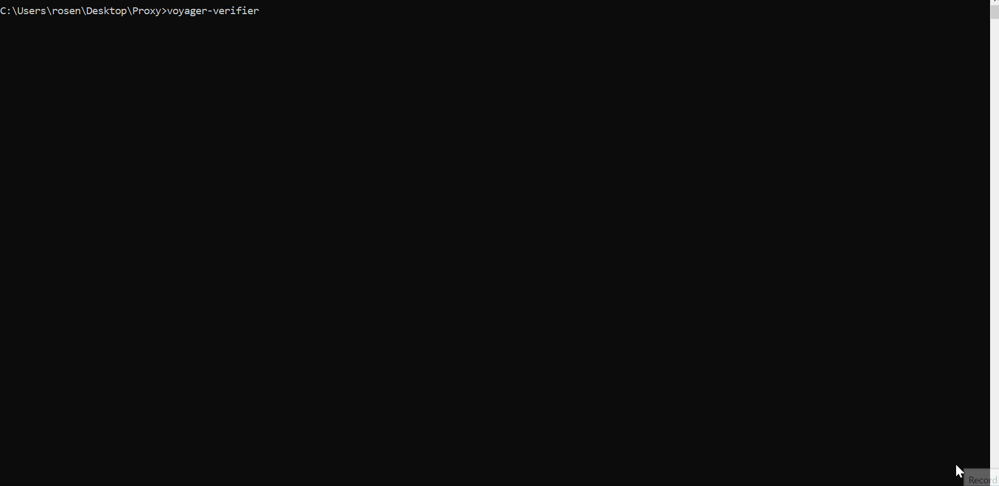

# Voyager CLI Verifier



## What is it?

A CLI Verifier Package for **[Voyager](https://voyager.online)**, the block explorer for **Starknet**, on top of our **[GUI Verifier](https://voyager.online/verify)** for better user experience with added support for **Nile** and **Protostar**!



## Installation

```
npm i -g voyager-verifier
```

or

```
npx voyager-verifier
```

## Usage

1. Prepare if you are using a third-party tool:
    - **Protostar**: run `protostar install`
    - **Nile**: activate your python virtual environment
1. Run `voyager-verifier` in you project's root folder and follow the instructions
1. Resolve any unresolved paths/dependencies in your project
1. You are done!



## Contact us
- **[Twitter](https://twitter.com/0xvoyageronline)**
- **[Discord](https://discord.gg/qypnmzkhbc)**
- **[Website](https://voyager.online)**
